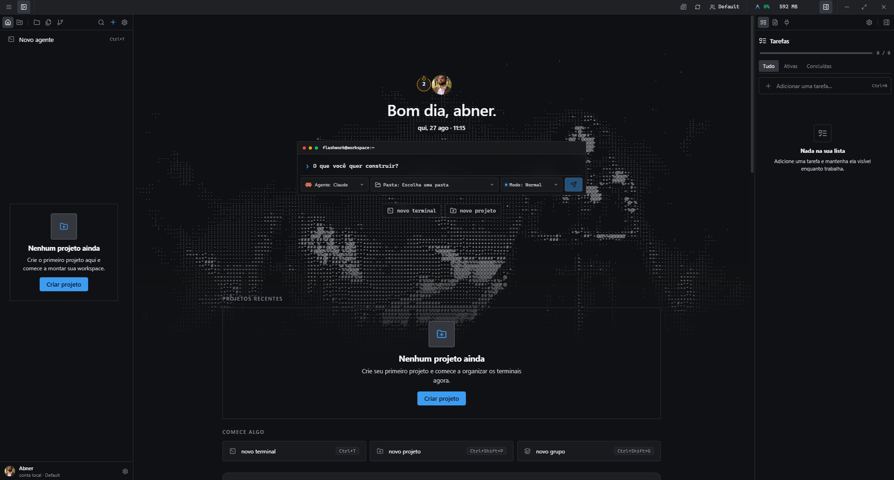
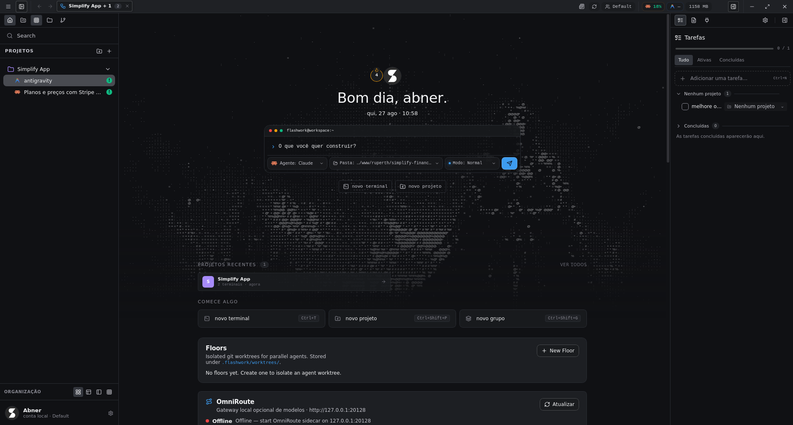
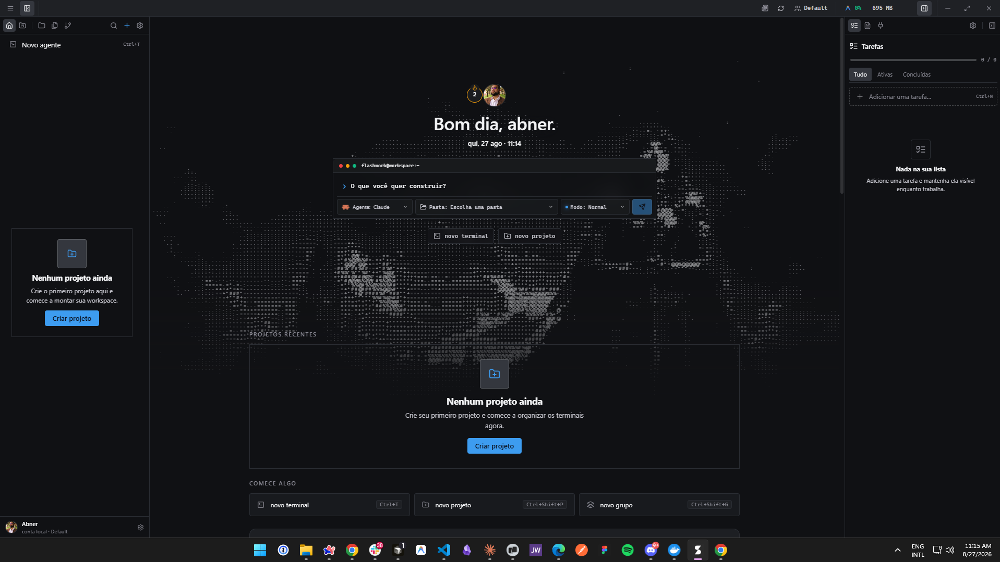
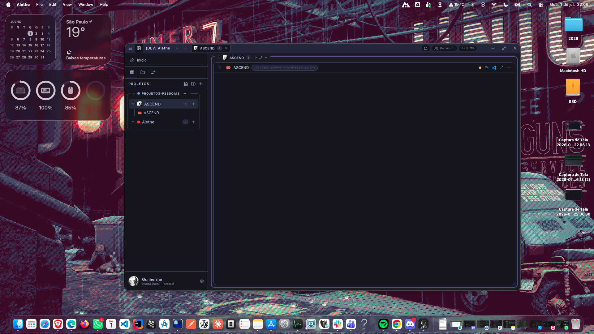

<p align="center">
  
</p>

<h1 align="center">Flashwork</h1>

<p align="center">
  <strong>Workspace desktop local-first para orquestrar agentes de código em paralelo.</strong><br>
  <em>Local-first desktop workspace for running coding agents side by side — real PTYs, not fake terminals.</em>
</p>

<p align="center">
  
  
  
  
  
</p>

Flashwork é um app nativo (Linux, macOS e Windows) que transforma terminais em unidades persistentes de trabalho: cada pane tem o próprio cwd, PTY, scrollback, abas e estado local. Você abre Claude Code, Codex, OpenCode, Copilot CLI e shells no mesmo workspace, vê o estado de cada um e retoma a sessão depois de fechar o app.

O produto é **local-first**. Projetos, preferências, layouts, histórico e credenciais ficam na máquina. Não há sync em nuvem.

Derivado de [Flashwork Agents](https://github.com/abnerndr/flashwork-agents) (AGPL-3.0), com marca **Flashwork** / Ruperth.

---

## Por que existe

Rodar vários agentes ao mesmo tempo vira caos: janelas soltas, sessões que se perdem, RAM que sobe sem controle e nenhum lugar que mostre o que cada CLI está fazendo.

Flashwork concentra isso num workspace único:

- PTYs reais no backend Rust (`portable-pty`), renderizados com `xterm.js`
- layouts em split, grid e spotlight, com drag-and-drop
- resume local de sessões de agente e scrollback
- controle de memória (desligar um terminal, um projeto ou suspender um grupo)
- handoff entre CLIs (Claude Code ↔ Codex) sem colar o transcript inteiro

---

## Screenshots

<p align="center">
  
</p>

<p align="center">
  
</p>

<details>
<summary>Windows e macOS</summary>

<p align="center">
  
  
</p>

</details>

Preview animado: [`apps/orchestrator/docs/assets/flashwork-preview.gif`](apps/orchestrator/docs/assets/flashwork-preview.gif)

---

## O que faz

| Área          | Capacidade                                                                                                                 |
| ------------- | -------------------------------------------------------------------------------------------------------------------------- |
| **Workspace** | Vários projetos abertos ao mesmo tempo, containers que fecham sem matar o PTY, fullscreen, flat mode, restore após restart |
| **Layouts**   | Auto, Spotlight, Sidebar e grid custom (colSpan / rowSpan, frações redimensionáveis)                                       |
| **Terminais** | Shell, Claude Code, Codex, OpenCode e GitHub Copilot CLI; spawn, attach, resize, restart, kill; busca in-terminal          |
| **Sub-abas**  | Vários agentes no mesmo pane, cada um com cwd e PTY próprios                                                               |
| **Resume**    | Scrollback em disco; sessões de agente retomáveis; handoff com contexto local redigido                                     |
| **Worktrees** | Isolamento de agentes em git worktrees (Floors)                                                                            |
| **MCP**       | Visão unificada de servers e skills entre Claude, Codex, OpenCode e Antigravity; copiar config de um agente para outro     |
| **Memória**   | Desabilitar terminal/projeto, suspender grupo, indicador de RAM na title bar                                               |
| **Contas**    | Vários perfis locais isolados (projetos, preferências, scrollback)                                                         |
| **Backup**    | Export/import `.zip` com proteção contra zip-slip e writes atômicos                                                        |
| **i18n**      | Inglês e pt-BR; o build falha se faltar chave de tradução                                                                  |

Lista completa: [`apps/orchestrator/docs/FEATURES.md`](apps/orchestrator/docs/FEATURES.md)

---

## Stack

| Camada        | Tecnologia                                             |
| ------------- | ------------------------------------------------------ |
| Shell desktop | [Tauri 2](https://tauri.app/)                          |
| Backend       | Rust (`portable-pty`, Tokio, serde, keyring, rusqlite) |
| Frontend      | React 18, TypeScript, Vite 6                           |
| Estado        | Zustand                                                |
| Terminal      | xterm.js + addons (fit, search, unicode11)             |
| Layout / DnD  | `react-resizable-panels`, `@dnd-kit/core`              |
| Persistência  | JSON local versionado + arquivos de scrollback         |
| Testes        | Vitest (frontend) + `cargo test` (Rust)                |
| CI            | GitHub Actions: lint, testes e build do frontend       |

Estilo via CSS Modules e design tokens (`theme.css`) — sem Tailwind.

---

## Modelo de domínio

```text
Group
└── Project
    └── Terminal
        ├── Shell tab
        ├── Claude Code tab
        └── Codex tab
```

- **Group** — coleção lógica de projetos (cor, ícone, suspend)
- **Project** — unidade de trabalho com terminais, layout e estado
- **Pane / Container** — representação visual de um projeto aberto
- **Terminal** — unidade persistente: cwd, sub-abas, PTY, scrollback
- **Sub-tab** — aba interna, em geral um agente ou um shell

Detalhes: [`apps/orchestrator/docs/OVERVIEW.md`](apps/orchestrator/docs/OVERVIEW.md)

---

## Requisitos

| Requisito            | Notas                                |
| -------------------- | ------------------------------------ |
| **Node.js ≥ 22**     | Definido em `package.json` `engines` |
| **Rust (stable)**    | Via [rustup](https://rustup.rs)      |
| **Toolchain nativo** | Ver scripts de setup por SO          |

Primeira vez no host:

```bash
./scripts/setup-linux.sh      # Ubuntu/Debian e WSL
./scripts/setup-macos.sh      # Xcode CLT
.\scripts\setup-windows.ps1   # MSVC / Visual Studio Build Tools
```

Linux precisa das deps do Tauri (webkit, gtk, rsvg, patchelf). O script de setup instala isso via `apt`.

---

## Rodar

Na raiz do repositório:

```bash
npm run setup          # instala deps do app
npm run test:local     # lint + testes + build do frontend
npm run dev            # abre o app (Tauri) — teste local
npm run dev:ui         # só o visual no browser (sem PTY)
```

A primeira execução de `npm run dev` compila o backend Rust do zero e leva alguns minutos. As seguintes são rápidas.

`dev:ui` sobe só o Vite — útil para UI, mas **não** spawna PTYs.

### Instalador (rode no SO correspondente)

```bash
npm run installer:linux      # AppImage + .deb
npm run installer:macos      # .dmg + .app
npm run installer:windows    # NSIS + MSI
npm run installer            # bundle do SO atual
```

Artefatos: `apps/orchestrator/src-tauri/target/release/bundle/`

Windows é a plataforma mais testada. Linux e macOS entram no fluxo de release; validação em máquina real ainda é bem-vinda.

---

## Estrutura

```
apps/orchestrator/     # único app — Tauri 2 + React + Rust
  src/                 # frontend (componentes, stores, i18n)
  src-tauri/           # backend Rust (PTY, projetos, agentes, MCP)
  docs/                # features, overview, changelog, screenshots
scripts/               # setup / dev / build por SO
.github/workflows/     # CI
```

---

## Documentação

| Doc                                                    | Conteúdo                               |
| ------------------------------------------------------ | -------------------------------------- |
| [`FEATURES.md`](apps/orchestrator/docs/FEATURES.md)    | Capacidades do produto                 |
| [`OVERVIEW.md`](apps/orchestrator/docs/OVERVIEW.md)    | Modelo de domínio, stack, persistência |
| [`CHANGELOG.md`](apps/orchestrator/docs/CHANGELOG.md)  | Histórico user-facing                  |
| [`CONTRIBUTING.md`](apps/orchestrator/CONTRIBUTING.md) | Setup, convenções, PRs                 |
| [`BRAND.md`](apps/orchestrator/docs/BRAND.md)          | Tokens visuais e assets                |

---

## Licença

O produto desktop (`apps/orchestrator` e os binários gerados dele) é **AGPL-3.0-or-later**.

Scripts e docs originais na raiz podem estar sob MIT, conforme o arquivo `LICENSE`. **Não trate o binário do orchestrator como MIT.**

Ver:

- [`LICENSE`](LICENSE)
- [`apps/orchestrator/NOTICE`](apps/orchestrator/NOTICE)
- [`apps/orchestrator/TRADEMARK.md`](apps/orchestrator/TRADEMARK.md)

Upstream: [Flashwork Agents](https://github.com/abnerndr/flashwork-agents)

---

## Autor

**Abner Ananias** — [Ruperth](https://github.com/abnerndr) · identificador do app `com.ruperth.flashwork`
